# Architecture Diagrams

Visual representations of the Web App Starter Pack architecture using Mermaid diagrams.

## System Overview

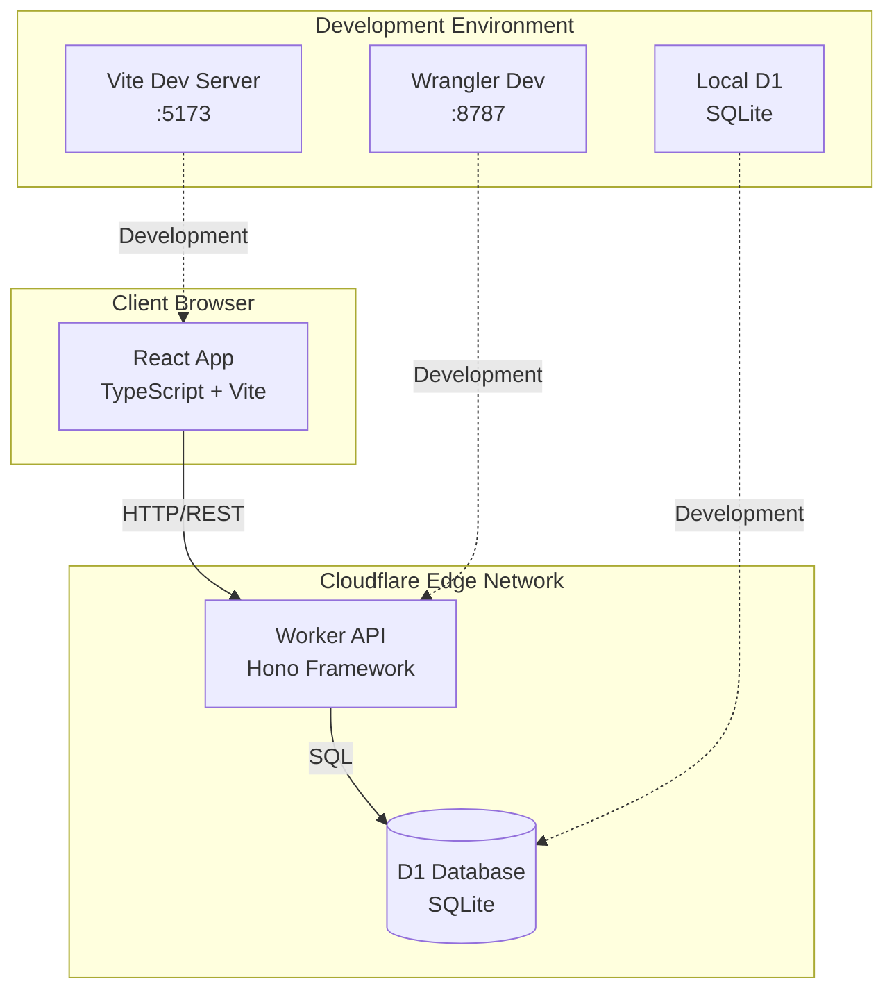

## Request Flow

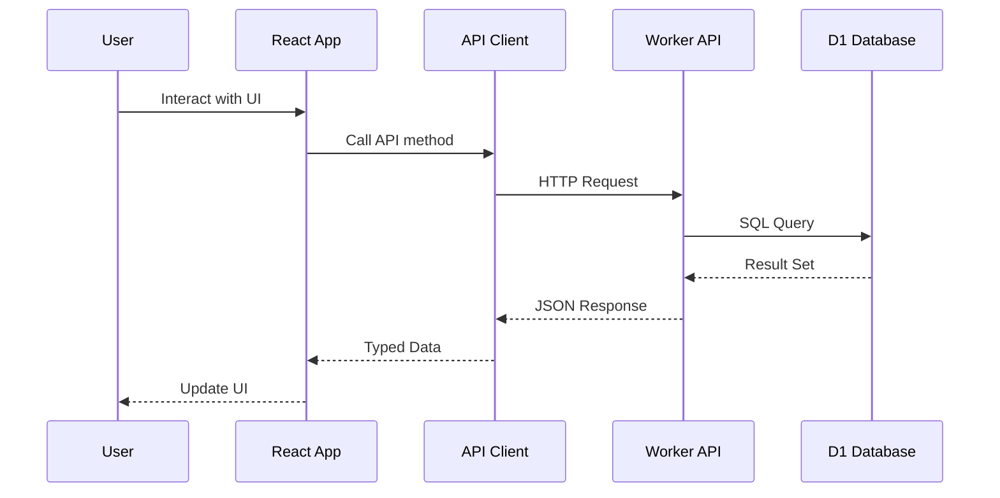

## Directory Structure

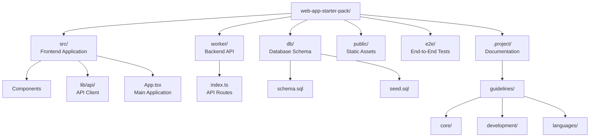

## Build & Deployment Pipeline

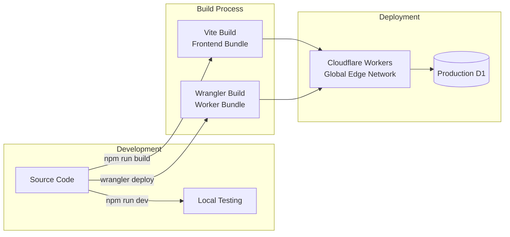

## API Architecture

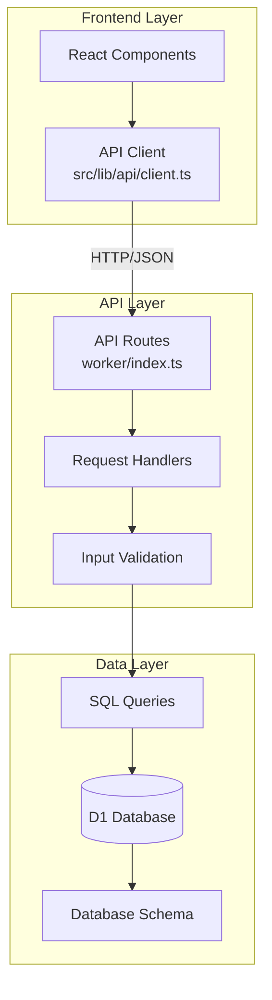

## Development Workflow

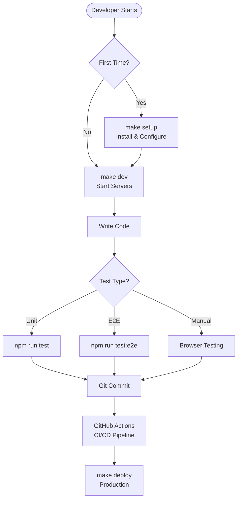

## Technology Stack Layers

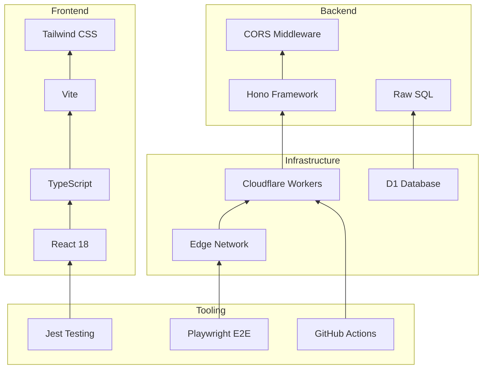

## Data Flow Pattern

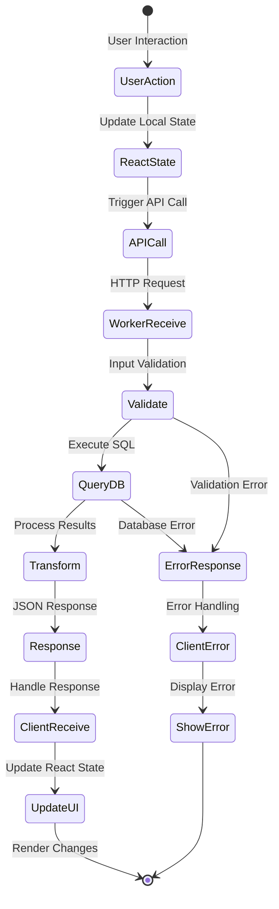

## Environment Configuration

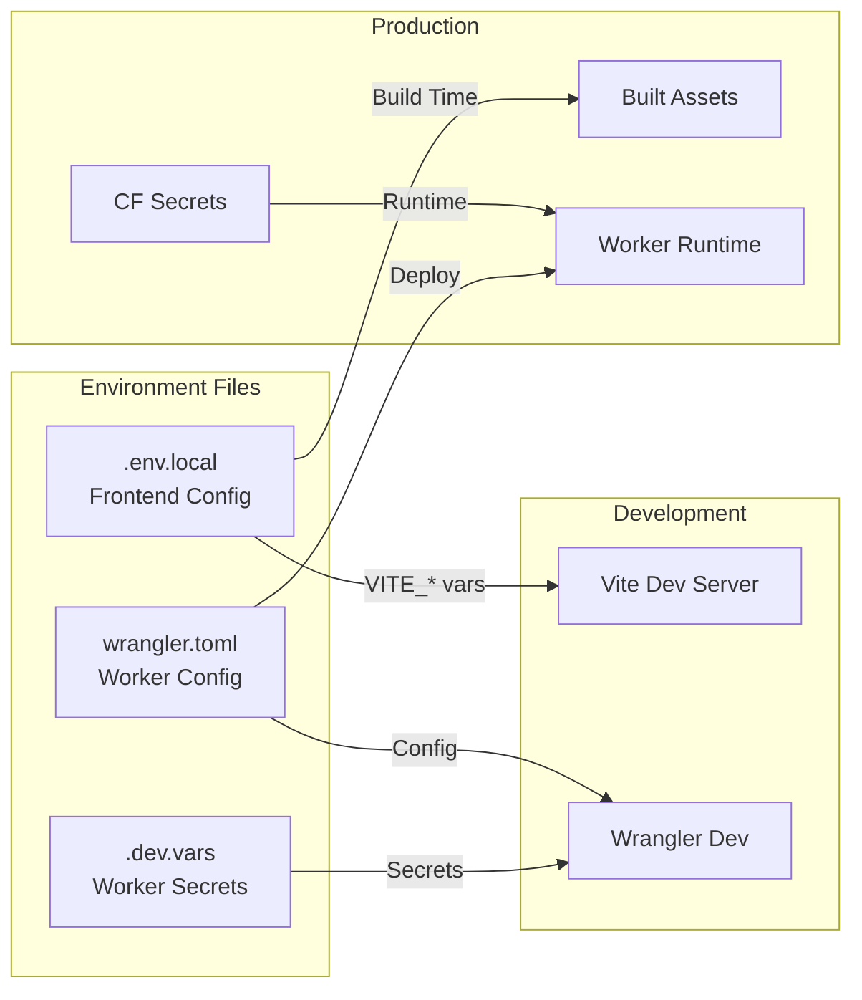

## Security Boundaries

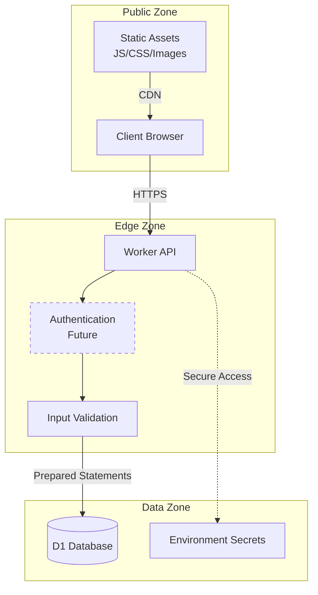

## Testing Architecture

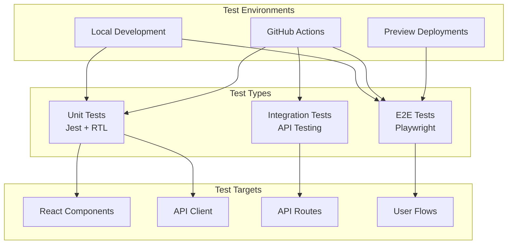