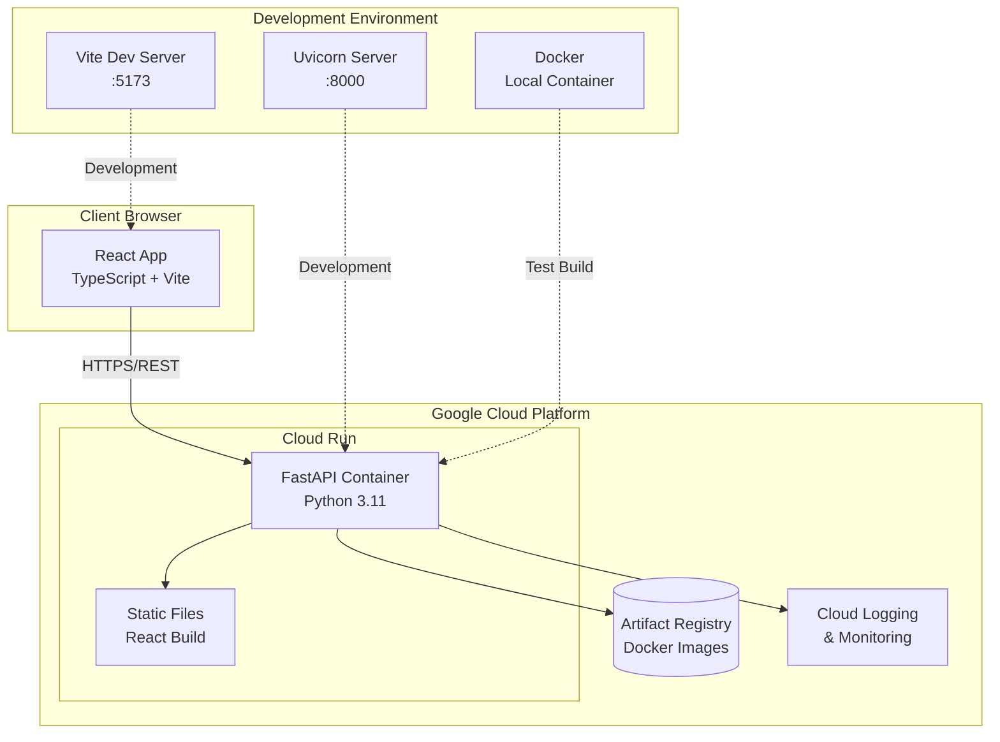
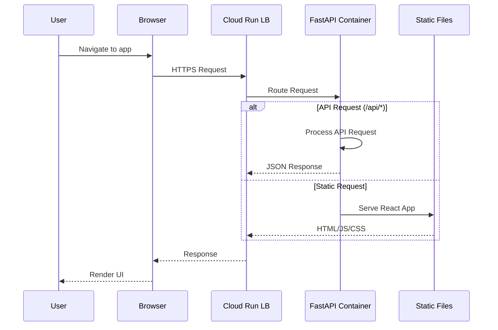
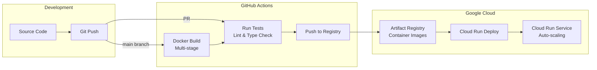
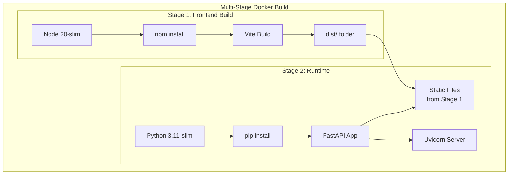
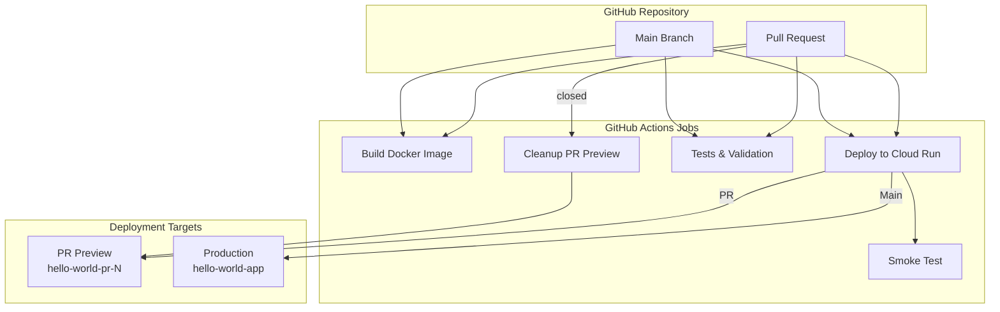
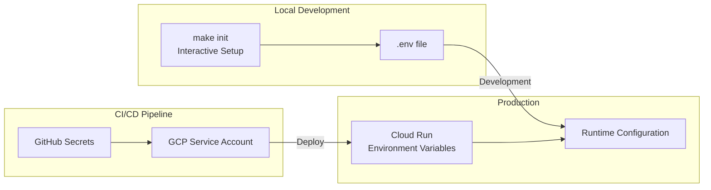
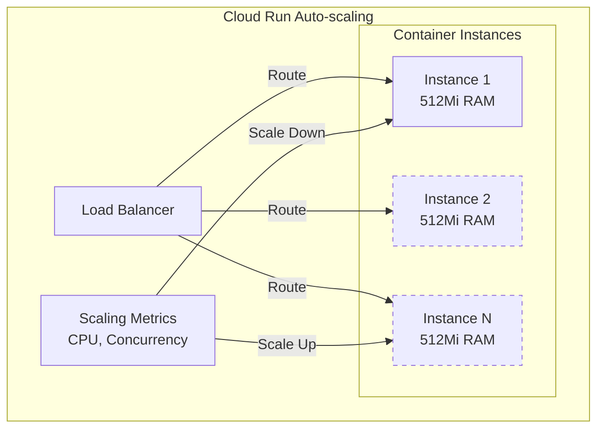
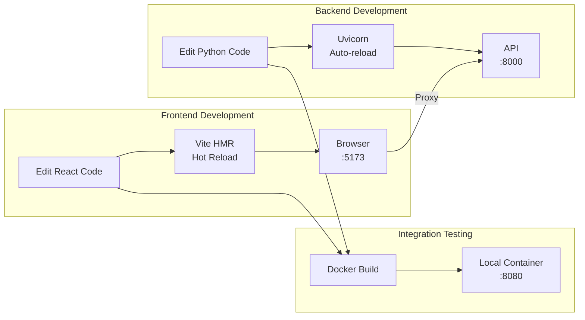

# Architecture Diagrams

Visual representations of the Web App Starter Pack architecture using Mermaid diagrams.

## System Overview



## Request Flow



## Deployment Pipeline



## Container Architecture



## CI/CD Workflow



## Environment Configuration



## API Architecture

```mermaid
graph TB
    subgraph "FastAPI Application"
        Main[main.py]
        
        subgraph "Middleware"
            CORS[CORS Middleware]
            ErrorHandler[Error Handling]
        end
        
        subgraph "API Routes"
            Health[/api/health]
            Hello[/api/hello]
            Future[Future Endpoints...]
        end
        
        subgraph "Static Serving"
            CatchAll[/* Catch-all Route]
            ReactApp[React SPA]
        end
    end
    
    Main --> CORS
    Main --> ErrorHandler
    Main --> Health
    Main --> Hello
    Main --> Future
    Main --> CatchAll
    CatchAll --> ReactApp
```

## Scaling Architecture



## Development Workflow



## Security Layers

```mermaid
graph TB
    subgraph "Security Architecture"
        subgraph "Network Layer"
            HTTPS[HTTPS Only]
            CloudArmor[Cloud Armor<br/>DDoS Protection]
        end
        
        subgraph "Application Layer"
            CORSConfig[CORS Configuration]
            InputVal[Input Validation]
            Headers[Security Headers]
        end
        
        subgraph "Container Layer"
            MinimalImage[Minimal Base Image]
            NonRoot[Non-root User]
            ReadOnly[Read-only Filesystem]
        end
        
        subgraph "Cloud Layer"
            IAM[IAM Roles]
            ServiceAcct[Service Accounts]
            Secrets[Secret Manager]
        end
    end
    
    HTTPS --> CloudArmor
    CloudArmor --> CORSConfig
    CORSConfig --> InputVal
    InputVal --> Headers
    Headers --> MinimalImage
    MinimalImage --> NonRoot
    NonRoot --> ReadOnly
    ReadOnly --> IAM
    IAM --> ServiceAcct
    ServiceAcct --> Secrets
```



These diagrams provide a comprehensive visual overview of the Google Cloud Run architecture, showing the complete system from development through deployment and production operation.